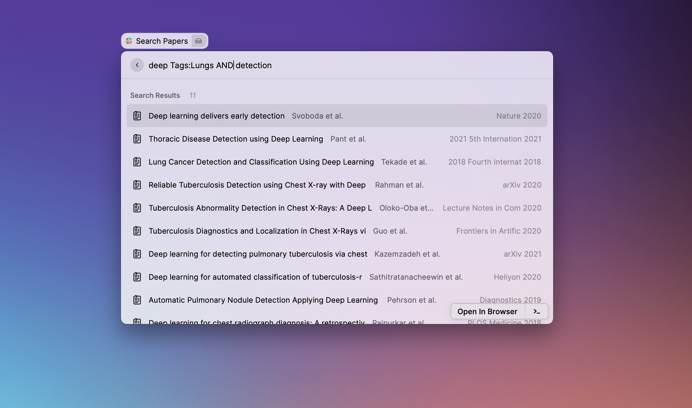

# Raycast Search Readcube Papers

This extension brings [Readcube Papers](https://www.papersapp.com/) search to raycast!

**Note: this extension is under active development and is subject to changes.**

## Getting started

Before using the command, you need to retrieve your readcube account credentials:

1. You library ID - This can be found by visiting your online account. This will be in the form of
   `https://app.readcube.com/library/xxxxxxxx-xxxx-xxxx-xxxx-xxxxxxxxxxxx/all` - Here `xxxxxxxx-xxxx-xxxx-xxxx-xxxxxxxxxxxx` will be your library_id.

   

2. Authentication cookie - retrieving this is little complicated.
   First you wil need to open the web app in Chrome, open chrome dev tools via `F12`.

   

   Now, if you perform a search, you can get your cookie as follows:

   

Note that you cookie wil start from `_readcube-login_token=xxxxxx.....`.

## Features

- Search your database using all the features supported on readcube app and web app.
- See https://support.papersapp.com/support/solutions/articles/30000037532-advanced-searching-in-library- for details!
- Only top 50 results are shown
